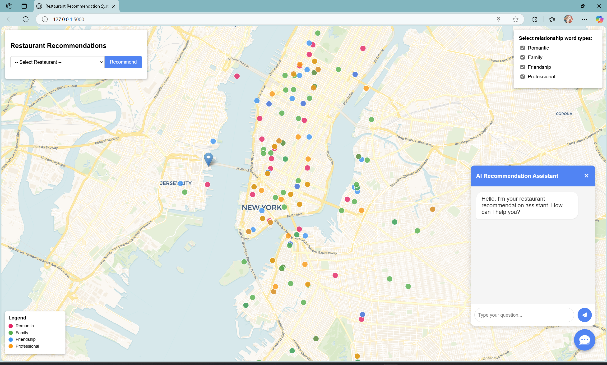

# 🍽️ Yelp Restaurant Recommendation Agent

A sophisticated web application designed to provide personalized restaurant recommendations. This system intelligently extracts keywords from user queries and leverages real-time environmental data to offer relevant and timely suggestions. It supports both query-based and restaurant-name-based recommendation modes, enhanced by an AI chatbot for natural language interaction.

---

## ✨ Features

-   **🗣️ Natural Language Processing**: Employs NLP techniques for intelligent keyword extraction from user queries.
-   **✌️ Dual Recommendation Modes**:
    -   **Query-Based**: Recommends restaurants by analyzing keywords extracted from user input.
    -   **Restaurant-Based**: Suggests restaurants similar to a user-selected one.
-   **ℹ️ Detailed Information**: Displays comprehensive details for each restaurant, including name, ratings, and price range.
-   **☀️ M_A_P Real-Time Environmental Factors**:
    -   **Weather Insights**: Retrieves and considers current weather conditions for the user's location.
    -   **Traffic Analysis**: Calculates live traffic conditions and estimated travel times to recommended venues.
-   **🎉 Social Context Classification**: Offers restaurant suggestions suitable for various social occasions like dating, family gatherings, friend meetups, and professional meetings.
-   **📱 Responsive User Interface**: Features an adaptive interface for seamless viewing on different devices, complete with integrated map visualization.
-   **🤖 AI Chatbot Assistant**: Facilitates natural language interaction with the recommendation system, powered by the Gemini API.
-   **🎯 Zero-Shot Classification**: Utilizes transformer models to categorize restaurants by social contexts without needing explicit pre-training for those categories.
-   **🗺️ Interactive Map**: Displays restaurant locations with a traffic overlay and categorized markers for easy navigation and decision-making.

---

## 📂 Directory Structure

```
restaurant-recommender/
├─ app.py                # Flask application entry point
├─ recommender.py        # Core recommendation functionality
├─ extract_keywords.py   # Keyword extraction functionality
├─ restaurant_type.py    # Restaurant social context classification
├─ requirements.txt      # Project dependencies
├─ Restaurant_Recommend_TF-IDF.py # TF-IDF model training script
├─ Restaurant_Recommend_SBert.py  # Sentence-BERT model training script
├─ test-zeroshot-result.py # Script for testing social context classification
├─ zeroshot-classify.py    # Zero-shot classification implementation
├─ get_reviews.py          # Script for retrieving restaurant reviews
├─ test-rs.py              # Testing script for recommendation system
├─ models/               # TF-IDF based models
│   ├─ restaurant_info.pkl        # Restaurant information
│   ├─ restaurant_similarity.pkl  # Similarity matrix
│   ├─ tfidf_vectorizer.pkl      # TF-IDF vectorizer
│   ├─ count_vectorizer.pkl      # Count vectorizer
│   └─ restaurant_vectors.pkl    # Restaurant vectors
├─ models_sbert/         # Sentence-BERT based models
│   ├─ restaurant_info_sbert.pkl        # Restaurant information
│   ├─ restaurant_similarity_sbert.pkl  # SBERT similarity matrix
│   └─ restaurant_embeddings_sbert.pkl  # SBERT embedding vectors
├─ data/                 # Data files
│   ├─ results.xlsx             # Restaurant information
│   ├─ yelp_reviews.xlsx        # Restaurant reviews
│   └─ labeled.xlsx             # Social context labeled data
├─ images/              # Project images and screenshots
│   ├─ app.jpg                 # Application interface screenshot
│   ├─ ClassificationReport.jpg # Classification report screenshot
│   ├─ SBERT.jpg       # SBERT method result screenshot 
│   └─ TF-IDF.jpg       # TF-IDF method result screenshot
├─ templates/
│   └─ index.html        # Main page template
└─ static/
    ├─ css/
    │   └─ styles.css    # Custom styles
    └─ js/
        └─ main.js       # Frontend interaction logic
```

---

## 🛠️ Technical Approach

### Recommendation Methods
-   **TF-IDF Model**: Processes restaurant data and reviews to create a robust keyword-based recommendation system.
-   **Sentence-BERT Model**: Leverages state-of-the-art transformer embeddings for more nuanced and semantic content matching.
-   **Hybrid Features**: Combines textual features (from descriptions, reviews) with numerical attributes (price, rating, review count, ranking) for enhanced accuracy.

### Zero-Shot Classification
-   Classifies restaurants into social contexts (e.g., romantic, family-friendly, suitable for friends, professional meetings) without requiring explicitly labeled training data for these specific contexts.
-   Employs two primary approaches:
    -   **BART-MNLI**: Utilizes a large model fine-tuned for natural language inference tasks.
    -   **SBERT-Seed**: Compares sentence embedding similarity with pre-defined seed sentences representative of each category.

### AI Chatbot
-   Powered by Google's cutting-edge **Gemini API**.
-   Provides context-aware and intelligent responses based on a synthesis of:
    -   User's specific queries and preferences.
    -   Current time, weather conditions, and real-time traffic information.
    -   Generated restaurant recommendations.
    -   Preferred social contexts.

---

## ⚙️ Installation and Setup

Follow these steps to get the Restaurant Recommendation System up and running on your local machine.

### Prerequisites
-   Python (version 3.8+ recommended)
-   Pip (Python package installer)

### Steps

1.  **Clone the Repository (if applicable)**
    ```bash
    git clone <repository-url>
    cd restaurant-recommender
    ```

2.  **Install Python Dependencies**:
    Navigate to the project root and run:
    ```bash
    pip install -r requirements.txt
    ```

3.  **Download SpaCy Language Model**:
    This model is used for keyword extraction.
    ```bash
    python -m spacy download en_core_web_trf
    ```

4.  **Configure Environment Variables**:
    Create a `.env` file in the project root directory (`restaurant-recommender/.env`). Add your API keys as follows:
    ```env
    HERE_API_KEY=your_here_api_key_here
    WEATHER_API_KEY=your_openweathermap_api_key_here
    GEMINI_API_KEY=your_gemini_api_key_here
    ```
    -   `HERE_API_KEY`: For real-time traffic information via HERE Routing API v8.
    -   `WEATHER_API_KEY`: For weather information via OpenWeatherMap API.
    -   `GEMINI_API_KEY`: For the AI chatbot assistant via Google Gemini API.

5.  **Ensure Data and Model Files are Ready**:
    Verify that all necessary data and pre-trained model files are present in their respective directories as outlined in the "Directory Structure" section.
    -   **Required Data Files**:
        -   `data/results.xlsx`
        -   `data/yelp_reviews.xlsx`
        -   `data/labeled.xlsx` (optional for direct use, primarily for training/evaluation)
    -   **Required Model Files (TF-IDF)**:
        -   `models/restaurant_info.pkl`
        -   `models/restaurant_similarity.pkl`
        -   `models/tfidf_vectorizer.pkl`
        -   `models/count_vectorizer.pkl`
        -   `models/restaurant_vectors.pkl`
    -   **Required Model Files (Sentence-BERT)**:
        -   `models_sbert/restaurant_info_sbert.pkl`
        -   `models_sbert/restaurant_similarity_sbert.pkl`
        -   `models_sbert/restaurant_embeddings_sbert.pkl`

6.  **Start the Flask Application**:
    ```bash
    python app.py
    ```

7.  **Access the Application**:
    Open your web browser and navigate to:
    ```
    http://localhost:5000
    ```

---

## 🚀 Usage Guide

### Query-Based Recommendation
1.  Enter your dining preferences or query in the search box. Examples:
    -   "Sushi in Manhattan"
    -   "I want to eat Italian food in Greenwich Village"
    -   "Spicy Sichuan food"
    -   "Cozy cafe with Wi-Fi"
2.  Press `Enter` or click the "Search" button.
3.  The system will display extracted keywords and a list of recommended restaurants matching your query.

### Restaurant-Based Recommendation
1.  Select a restaurant from the provided dropdown list.
2.  Click the "Recommend" button.
3.  The system will present a list of restaurants similar to your chosen one based on its characteristics.

### AI Chatbot Assistant
Engage with the AI chatbot using natural language through the chat interface. The assistant considers:
-   Your specific needs and preferences.
-   Current time of day.
-   Live weather conditions.
-   Real-time traffic information.
-   Suitable social contexts (dating, family, friends, business).

### Interactive Map
-   Visualize recommended restaurants directly on an interactive map.
-   Filter restaurant markers by social context (romantic, family, friendship, professional).
-   Toggle the traffic information layer to assess travel conditions.
-   Use the location button to center the map on your current geographical position.

---

## 🧠 Model Training

If you wish to retrain the models with new data or modified parameters:

### TF-IDF Model Training
To train or retrain the TF-IDF based recommendation model:
```bash
python Restaurant_Recommend_TF-IDF.py
```

### Sentence-BERT Model Training
To train the Sentence-BERT based recommendation model:
```
python Restaurant_Recommend_SBert.py
```

### Zero-Shot Classification Evaluation
To evaluate the social context classification performance:
```
python test-zeroshot-result.py
```

---

## 💻 Technology Stack

-   **Backend**: Flask, Python
-   **Frontend**: HTML, CSS, JavaScript
-   **Mapping**: Leaflet.js
-   **Recommendation Algorithms**:
    -   TF-IDF vectorization with Cosine Similarity
    -   Sentence-BERT embeddings with Cosine Similarity
    -   Hybrid feature combination (textual + numerical attributes)
-   **NLP Components**:
    -   **Keyword Extraction**: spaCy with PyTextRank
    -   **Zero-Shot Classification**: Transformer models (e.g., BART-MNLI)
    -   **Semantic Embeddings**: Sentence-BERT (from `sentence-transformers` library)
    -   **Core NLP library**: scikit-learn
-   **External APIs**:
    -   **Weather**: OpenWeatherMap API
    -   **Traffic & Routing**: HERE Routing API v8
    -   **Base Maps**: Mapbox Maps API (often used with Leaflet for tiles)
    -   **AI Chatbot**: Google Gemini API

---

## 🐍 Python Files Description

### Core Application Files
-   `app.py`: Main entry point of the Flask web application. Handles all web requests, routing, and integrates different modules.
     *(This image will render if `images/app.jpg` is accessible at this path relative to the Markdown file's location when viewed, e.g., on GitHub.)*
-   `recommender.py`: Contains the core recommendation logic, implementing both TF-IDF and Sentence-BERT based recommendation algorithms.
-   `extract_keywords.py`: Implements keyword extraction functionality using NLP techniques (spaCy, PyTextRank) from user queries.
-   `restaurant_type.py`: Manages the classification of restaurants into social contexts (e.g., romantic, family-friendly) using zero-shot learning.

### Model Training & Evaluation Files
-   `Restaurant_Recommend_TF-IDF.py`: Script for training the TF-IDF based recommendation model. Prepares data, builds TF-IDF matrices, and calculates similarity.
-   `Restaurant_Recommend_SBert.py`: Script for training the Sentence-BERT based recommendation model. Generates embeddings for restaurant data and computes similarity.
-   `zeroshot-classify.py`: Core implementation of the zero-shot classification logic using transformer models for restaurant context categorization.
-   `test-zeroshot-result.py`: Script for testing and evaluating the performance of the zero-shot classification model.

### Data Processing & Utility Files
-   `get_reviews.py`: Script dedicated to retrieving, cleaning, and processing restaurant review data (e.g., from `yelp_reviews.xlsx`).
-   `test-rs.py`: A testing script for the overall recommendation system to validate the accuracy and relevance of recommendation results.

---
